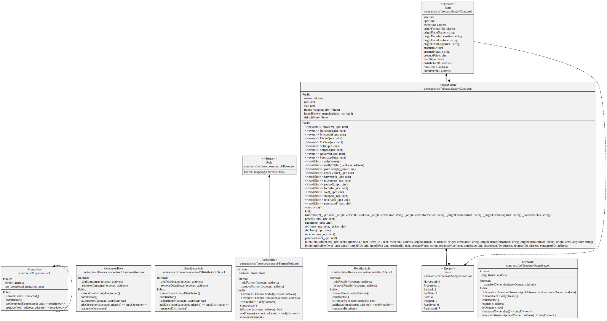

# Ethereum Coffee Supply Chain
A basic Ethereum DApp demonstrating the coffee supply chain from the farmer's harvest to the customer's final consumption.

## UML Diagrams
- Activity Diagram

- Sequence Diagram

- State Diagram

- Class Diagram

## Libraries Used
- **Truffle v5.7.8 (core: 5.7.8)**
- **Ganache v7.7.5** 
- **Solidity - 0.8.10 (solc-js)**
- **Node v18.14.2**
- **Web3.js v1.8.2**
- **sol2uml 2.5.1** - _To generate solidity Class Diagram_

## IPFS not used
