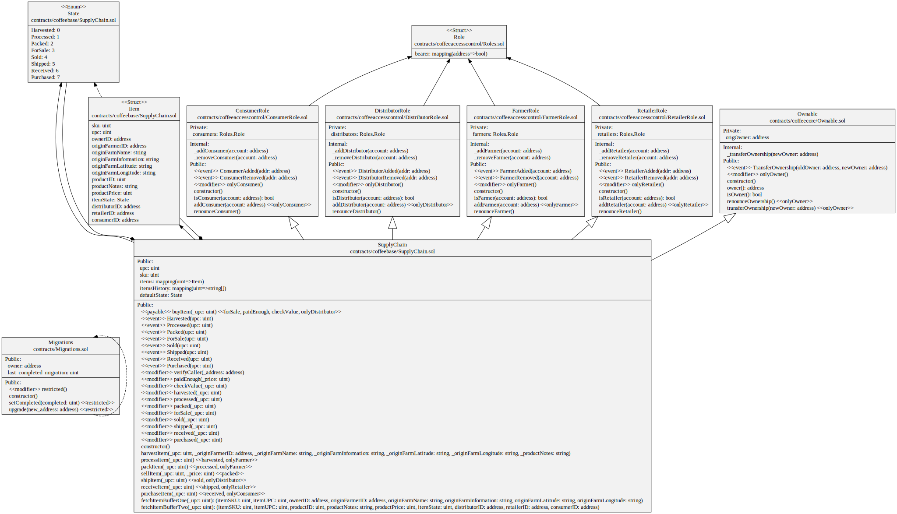
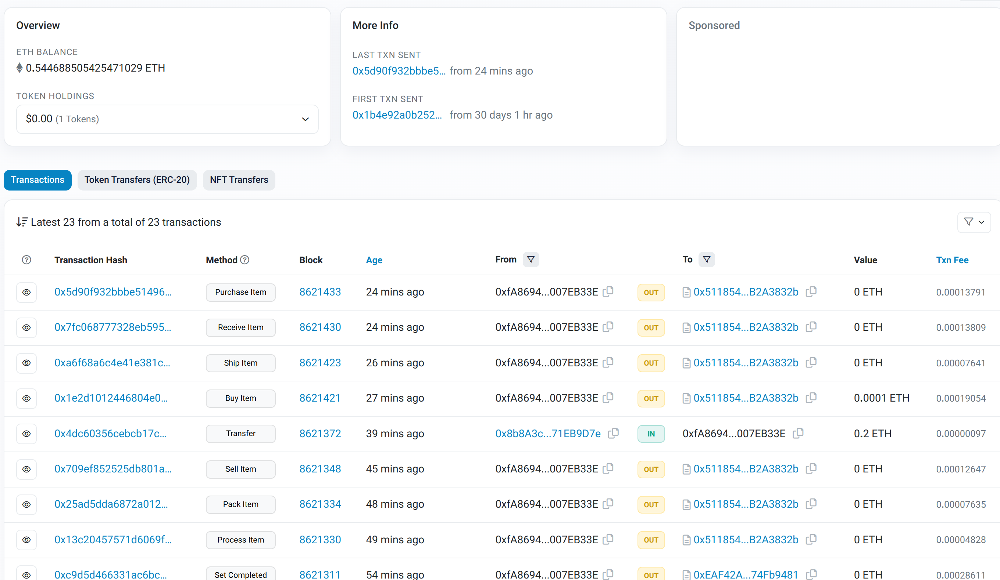

# Ethereum Coffee Supply Chain

A basic Ethereum DApp demonstrating the coffee supply chain from the farmer's harvest to the customer's final consumption.

## UML Diagrams

- Activity Diagram

- Sequence Diagram

- State Diagram

- Class Diagram

## Libraries

- **Truffle v5.7.9 (core: 5.7.9)**
- **Ganache v7.7.5**
- **Solidity - 0.8.17 (solc-js)**
- **Node v18.14.2**
- **Web3.js v1.8.2**
- **sol2uml 2.5.1** - _To generate solidity Class Diagram_

## Goerli transactions

[https://goerli.etherscan.io/address/0xfa86941c9c7c4a14979e693408a8724e007eb33e](https://goerli.etherscan.io/address/0xfa86941c9c7c4a14979e693408a8724e007eb33e)

## Getting Started (locally)

From root directory:

1. `npm install`
2. `npm install truffle`
3. `npm install -s @truffle/contract`
4. `npm install -s web3`
5. `npm install -g ganache-cli`
6. `./node_modules/.bin/truffle compile`
7. `./node_modules/.bin/truffle migrate --reset`
8. `./node_modules/.bin/truffle test`
9. `./node_modules/.bin/truffle deploy`
10. `npm run dev`

## Deploy contracts to Goerli

1. Edit `infuraKey` and `mnemonic` in `truffle-config.js`
2. `truffle migrate --network goerli`

## IPFS Deployment

[https://ipfs.io/ipfs/QmV8mPAkgn9oyuSviKbyGbmkT9kjFoLmfFKB7fUsfs7NBD/ipfsc/](https://ipfs.io/ipfs/QmV8mPAkgn9oyuSviKbyGbmkT9kjFoLmfFKB7fUsfs7NBD/ipfsc/)
